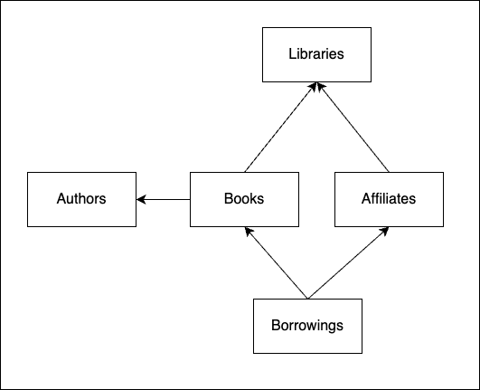
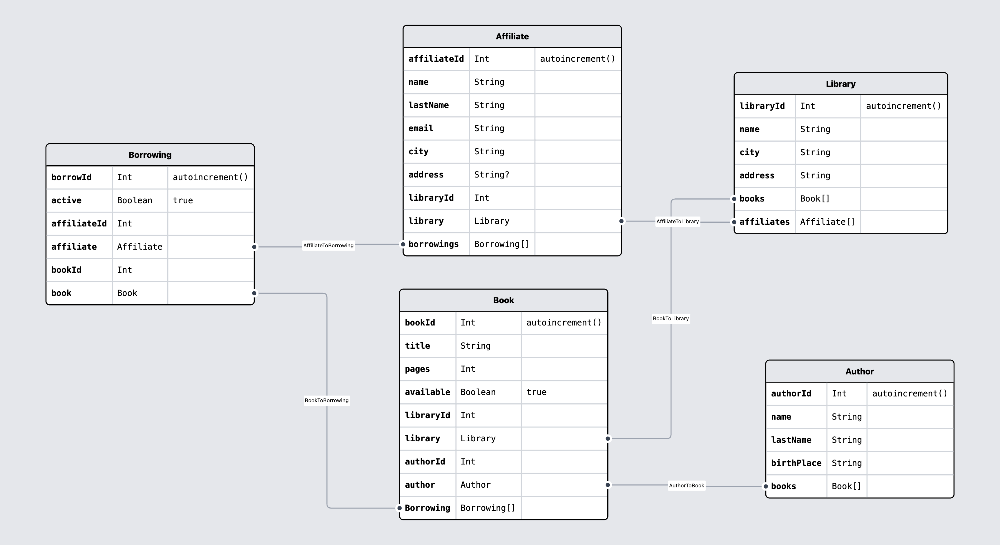

# Práctica 3 del Posgrado Full-Stack Web Technologies, por Ferran Bals

## Proyecto: Modelo de datos para una biblioteca

### Acerca del autor

**Autor**: Ferran Bals Moreno

**Perfil de GitHub:** [franksparks](https://github.com/franksparks)

## Descripción de la práctica realizada

### Introducción

Se ha diseñado un modelo de datos para la gestión de una red de bibliotecas y los préstamos de libros a sus socios.

Diagrama del modelo de datos:

Modelo detallado por Prismaliser:

<b>Descripción de las entidades:</b>

- Las <u><b>bibliotecas</b></u> cuentan con socios (affiliates) y libros. Una biblioteca puede tener varios socios y varios libros.
- Un <u><b>socio</b></u> lo es de una biblioteca, y cuenta con x préstamos (tanto activos como inactivos).
- Un <u><b>libro</b></u> se encuentra en una biblioteca y está escrito por un autor, pero puede formar parte de varios préstamos (sólo 1 de ellos activo).
- Un <u><b>autor</b></u> puede haber escrito varios libros.
- Un <u><b>préstamo</b></u> relaciona el socio y el libro prestado.

<b>Notas:</b>

- Un socio no puede tener más de 3 libros en préstamo simultáneamente (préstamos activos).
- Un libro en préstamo no puede ser prestado a otro socio.

### Instrucciones

Para lanzar el modelo de datos debemos seguir los siguientes pasos:

1. Clonar el repositorio
2. Instalar las dependencias -> <code>bun install</code>
3. Lanzar el contenedor de Postgres -> <code>docker-compose -f docker docker-compose.yml up -d</code>
4. Generar la base de datos mediante <code>bun x prisma db push</code>

5. Poblar la base de datos -> <code>bun x prisma db seed</code>

   Este comando inyectará:

   - 10 socios (Affiliate)
   - 5 autores (Author)
   - 25 libros (Book)
   - 10 préstamos (Borrowing)
   - 5 bibliotecas (Library)

6. Ejecutar los scripts proporcionados

## Descripción de los scripts proporcionados

### Authors

- <code>all-authors.ts</code> -> Devuelve el listado de los autores.
- <code>find-author-by-id.ts</code> -> Búsqueda por authorId. Devuelve un autor.
- <code>find-authors-by-lastname.ts</code> -> Búsqueda por lastName. Devuelve una lista de autores.
- <code>new-author.ts</code> -> Permite introducir un nuevo autor.

### Affiliates

- <code>all-affiliates.ts</code> -> Devuelve el listado de los socios, de todas las bibliotecas.
- <code>find-affiliate-by-id.ts</code> -> Búsqueda por affiliateId. Devuelve un socio.
- <code>find-affiliates-by-lastname.ts</code> -> Busca socios por lastName. Devuelve una lista de socios.
- <code>find-affiliates-by-library-id.ts</code> -> Devuelve el listado de los socios de una biblioteca en concreto.
- <code>new-affiliate.ts</code> -> Permite introducir un nuevo socio a una biblioteca.

### Books

- <code>all-books.ts</code> -> Devuelve el listado de los libros.
- <code>book-availability.ts</code> -> Dado un bookId, devuelve un booleano según si el libro está o no en préstamo.
- <code>find-book-by-id.ts</code> -> Búsqueda por bookId. Devuelve un libro.
- <code>find-books-by-author.ts</code> -> Búsqueda por authorId. Devuelve una lista de libros.
- <code>find-books-by-library.ts</code> -> Búsqueda por libraryId. Devuelve una lista de libros.
- <code>find-books-by-title.ts</code> -> Búsqueda por title. Devuelve una lista de libros.
- <code>new-book.ts</code> -> Permite introducir un nuevo socio a una biblioteca.

### Borrowings

- <code>all-active-borrowings.ts</code> -> Devuelve el listado de préstamos activos.
- <code>find-active-borrowing-by-book-id.ts</code> ->
- <code>find-active-borrowing-by-affiliate-id.ts</code> -> Búsqueda por affiliateId. Devuelve el listado de préstamos activos por parte de un socio.
- <code>find-all-borrowings-by-affiliate-id.ts</code> ->
- Búsqueda por affiliateId. Devuelve el listado de préstamos, activos o pasados, por parte de un socio.
- <code>new-borrowing-availability-check.ts</code> -> Se genera un nuevo préstamo por affiliateId y bookId.
  - Se comprueba que el usuario no tenga ya 3 préstamos activos.
  - Se comprueba que el libro esté disponible.
  - Se genera el préstamo.
  - se actualiza el estado del libro a no disponible.
- <code>return-book.ts</code> -> Devolución de un préstamo por bookId.

  - Se comprueba que el libro no esté disponible.
  - Se actualiza el préstamo a inactivo.
  - se actualiza el estado del libro a disponible.

- ### Libraries

- <code>all-libraries.ts</code> -> Devuelve el listado de las bibliotecas.
- <code>find-library-by-id.ts</code> -> Búsqueda por libraryId. Devuelve una biblioteca.
- <code>find-library-by-name.ts</code> -> Búsqueda por libraryId. Devuelve una biblioteca.
- <code>new-library.ts</code> -> Permite introducir una nueva biblioteca.

---

# Enunciado original

# Modelo de Datos

En esta práctica hay que desarrollar el modelo de datos para una aplicación que resulte de tu interés. (No es necesario pensar en la autenticación aún, estudiaremos eso por separado.)

Se trata, como otras veces, de hacer un _fork_ de este repositorio y trabajar en él.

La solución del ejercicio debe ser un proyecto Javascript con:

- El esquema de Prisma (`schema.prisma`).
- La configuración para una base de datos (con `docker-compose.yml`).
- Rellenado con unos pocos datos de prueba.
- Scripts en Typescript de demostración que hacen algunas cosas con los datos.
- Documentación sobre cómo lanzar la base de datos y usar los scripts de demostración (sustituyendo este mismo README).

## Esquema

El esquema debe tener almenos 3 entidades, pero no hay límite superior. Empieza siempre por definir las entidades más importantes, y asegúrate de que las relaciones cumplen con las necesidades que has planteado (nunca hay una única solución, cada solución tienes sus ventajas e inconvenientes, simplemente hay que ser conscientes de ellos). Luego añade entidades para hacer crecer el modelo. No intentes hacerlo todo de golpe (a no ser que ya tengas experiencia).

## Rellenado de datos de prueba

Para crear los datos iniciales con los que poder hacer algo al principio se puede usar cualquier mecanismo que automatice la inserción. Se recomienda mirar la documentación sobre como usar `seed.ts` en Prisma, que es una manera semi-estandarizada.
